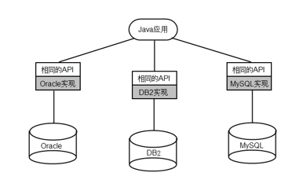
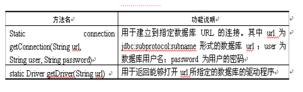
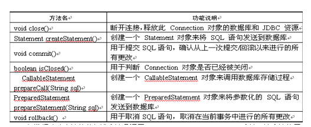
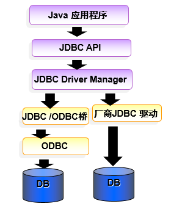
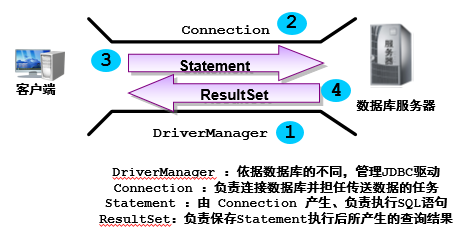

# JDBC

## 一、概述

通过使用JDBC API，Java程序可以非常方便地操作各种主流数据库，这是Java语言的巨大魅力所在。而且由于Java语言的**跨平台**特性，所以使用JDBC API所编写的程序不仅可以实现跨数据库，还可以跨平台，具有非常优秀的可移植性

程序使用JDBC API以**统一的方式**来连接**不同的数据库**，然后通过Statement对象来执行标准SQL语句，并可以获得SQL语句访问数据库的结果（查询-resultset）。因此掌握标准SQL语句是学习JDBC编程的基础，本章将会简要介绍关系数据库理论基础，并以MySQL数据库为例来讲解标准SQL语句的语法细节。包括基本查询语句，多表连接查询和子查询等。

为了JDBC程序可以跨平台，则需要不同数据库厂商提供相应的驱动，下图显示了JDBC驱动的示意图。 




**JAVA驱动类型**

第一种JDBC驱动：称为JDBC–ODBC桥，这种驱动是最早实现的JDBC驱动程序，主要目的是为了快速推广JDBC。这种驱动程序将JDBC API映射到ODBC API。JDBC-ODBC也需要驱动，这种驱动由Sun公司提供实现。

第二种JDBC驱动：直接将JDBC API映射成数据库特定的客户端API。这种驱动程序包含特定数据库的本地代码，用于访问特定数据库的客户端。

第三种JDBC驱动：支持三层结构的JDBC访问方式。主要用于Applet阶段，通过Applet访问数据库

第四种JDBC驱动：**是纯Java的**，直接与数据库实例交互。这种驱动是智能的，它知道数据库使用的底层协议。这种驱动是目前最流行的JDBC驱动。


##二、JDBC编程 

###2.1常用接口和类

DriverManager 驱动管理-》获取数据库连接

Connection-》数据库连接

Statement-》执行sql语句

PreparedStatement-》执行sql语句，推荐使用，继承Statement

CallableStatement-》调用存储过程/函数

ResultSet-》查询（select语句）的结果集，掌握ResultSet遍历

DriverManager类的常用方法 



Connection 接口代表与数据库的连接 




### 2.2JDBC编程步骤 

（1）加载数据库驱动。

（2）通过DriverManager获取数据库连接。

（3）通过Connection对象创建Statement对象。

（4）使用Statement执行SQL语句。所有Statement都有如下三个方法来执行SQL语句 executeQuery,executeUpdate,execute。

（5）操作结果集。如果执行的SQL语句是查询语句，执行结果将返回一个ResultSet对象，该对象里保存了SQL语句查询的结果。程序可以通过操作该ResultSet对象来取出查询结果

  (6) 关闭连接，语句和结果集

###2.3JDBC的工作原理 



JDBC API 可帮我们建立与数据库的连接、执行SQL语句并能得到SQL语句执行后的结果




###2.4编码实现

**创建用户sysuser用户表**

```
		CREATE TABLE sysuser(
			id int PRIMARY KEY AUTO_INCREMENT,
			userName VARCHAR(32),
			pwd	VARCHAR(32),
			nickName varchar(32)
		);

		INSERT into sysuser (id,userName,pwd,nickName) values
		(null,'admin','0000','管理员'),
		(null,'aaa','0000','张三'),
		(null,'bbb','1111','李四'),
		(null,'ccc','0000','王五');
```

**添加驱动jar包，添加之后jar就导入了工程中，可以正常使用它了**

1. 创建lib文件夹，添加jar包到该文件夹下
2. 在jar包上右击-》build path -》add to build path

**加载数据库驱动**

3. 加载数据库驱动

```
Class.forName("com.mysql.jdbc.Driver");
```

**通过DriverManager获取数据库连接**

4. 获取连接Connection

​        localhost：主机名或者ip地址

​        3306：mysql端口号

​        tzhang：要连接的mysql中的数据库

```
Connection connection = DriverManager.getConnection("jdbc:mysql://localhost:3306/tzhang", "root", "123456");
```

**获取Statement对象**

5. 通过连接对象Connection获取Statement对象

```
Statement  stmt = connection.createStatement();
```

**执行查询Sql语句**

6. 通过statement执行select语句

```
// 执行查询，将结果保存到ResultSet中，即结果集中
ResultSet rs = stmt.executeQuery(sql);
```

**遍历结果集**

7. 遍历ResultSet

   ```
   while (rs.next()) {
       // 根据查询的列名遍历结果集
       // int id = rs.getInt("id");
       // String uname = rs.getString("userName");
       // String pwd = rs.getString("pwd");
       // String nickName = rs.getString("nickname");
   
       // 根据查询的列索引遍历结果集
       int id = rs.getInt(1);
       String uname = rs.getString(2);
       String pwd = rs.getString(3);
       String nickName = rs.getString(4);
   
       System.out.println(id + "," + uname + "," + pwd + "," + nickName);
   }
   ```

**关闭资源**

8. 关闭结果集，语句，连接，关闭顺序与打开顺序相反

   ```
      finally {
   			// 关闭资源
   			closeAll(rs,stmt,connection);
      }
   		   
   	
   	public static void closeAll(ResultSet rs, Statement stmt, Connection conn) {
   		close(rs);
   		close(stmt);
   		close(conn);
   	}
   	
   	public static void close(AutoCloseable close) {
   		if (null != close) {
   			try {
   				close.close();
   			} catch (Exception e) {
   				// TODO Auto-generated catch block
   				e.printStackTrace();
   			}
   		}
   	}
   ```

**保存到对象中**

创建POJO类(pojo 简单的java对象  plain original java object)

```
public class SysUser {
	
	private int id;
	private String userName;
	private String pwd;
	private String nickName;
	public int getId() {
		return id;
	}
	public void setId(int id) {
		this.id = id;
	}
	public String getUserName() {
		return userName;
	}
	public void setUserName(String userName) {
		this.userName = userName;
	}
	public String getPwd() {
		return pwd;
	}
	public void setPwd(String pwd) {
		this.pwd = pwd;
	}
	public String getNickName() {
		return nickName;
	}
	public void setNickName(String nickName) {
		this.nickName = nickName;
	}
	
	
	@Override
	public String toString() {
		return "SysUser [id=" + id + ", userName=" + userName + ", pwd=" + pwd + ", nickName=" + nickName + "]";
	}
	
}
```

遍历ResultSet保存到集合对象中

```
public static void conn() {
		
		ResultSet rs = null;
		Statement stmt = null;
		Connection connection = null;
		
		List<SysUser> listUser = new ArrayList<SysUser>();
		
		try {
			// 加载数据库驱动
			Class.forName("com.mysql.jdbc.Driver");
			// 获取数据库连接 java.sql.Connection
			connection = DriverManager.getConnection("jdbc:mysql://localhost:3306/tzhang", "root", "123456");

			stmt = connection.createStatement();
			String sql = "SELECT * from sysuser";
			// 执行查询，将结果保存到ResultSet中，即结果集中
			rs = stmt.executeQuery(sql);
			// 遍历结果集
			while (rs.next()) {
				// 根据查询的列名遍历结果集
				// int id = rs.getInt("id");
				// String uname = rs.getString("userName");
				// String pwd = rs.getString("pwd");
				// String nickName = rs.getString("nickname");
				// 根据查询的列索引遍历结果集
				int id = rs.getInt(1);
				String uname = rs.getString(2);
				String pwd = rs.getString(3);
				String nickName = rs.getString(4);
				// 表中的行转成实例
				SysUser su = new SysUser();
				su.setId(id);
				su.setUserName(uname);
				su.setPwd(pwd);
				su.setNickName(nickName);
				// 添加到集合中
				listUser.add(su);
			
			}

		} catch (ClassNotFoundException e) {
			// TODO Auto-generated catch block
			e.printStackTrace();
		} catch (SQLException e) {
			// TODO Auto-generated catch block
			e.printStackTrace();
		} finally {
			// 关闭资源
			closeAll(rs,stmt,connection);
		}
		
		// for-each循环遍历集合
		for(SysUser s:listUser) {
			System.out.println(s.toString());
		}
	
		
	}
```


创建了Statement接口的实例后，可调用其中的方法执行SQL语句，JDBC中提供了三种执行方法，它们是execute()、executeQuery()和executeUpdate()。

**executeUpdate方法** ：这个方法一般用于执行SQL的INSERT、UPDATE或DELETE语句，当执行INSERT等SQL语句时，此方法的返回值是执行了这个SQL语句后**所影响的记录的总行数**

**executeQuery方法** ：一般用于执行SQL的SELECT语句。它的返回值是执行SQL语句后产生的一个ResultSet接口的实例(结果集)。 

**execute方法** ：一般是在用户不知道执行SQL语句后会产生什么结果或可能有多种类型的结果产生时才会使用。execute()的执行结果包括如下两种情况：

​    1.包含多个ResultSet（结果集）；

​    2.多条记录被影响；

##配置文件设置数据库连接参数

新建jdbc.properties配置文件，文件内容如下

```
driver=com.mysql.jdbc.Driver
url=jdbc:mysql://localhost:3306/tzhang
username=root
passwd=123456
```

修改数据库连接信息设置

```

```


**作业**

完成一张表信息的增删查改操作


**预习**

SQL注入理解

**PreparedStatement**


