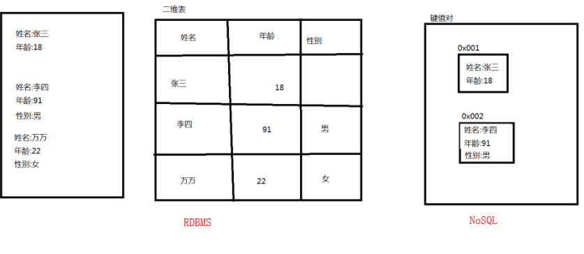

# MYSQL

[TOC]

## 一、数据库概述

### 1.1数据管理技术的发展阶段

1. 人工阶段 50年代中期以前（磁带、纸带，无磁盘 ）
2. 文件  50年代后期到60年代中期（磁盘 ）
3. 数据库系统 60年代后期（大容量磁盘，硬件价格下降 ）

### 1.2数据库

数据库(Database)是按照数据结构来组织、存储和管理数据的仓库。

数据库中的数据按一定的数据模型组织、描述和储存，具有较小的冗余度、较高的数据独立性和易扩展性，并可为各个用户共享。

**数据库的作用？**

存储大量数据，方便查询与操作（select）

保持数据信息的一致,完整（主键 primary key 外键 foreign key 约束 check）

共享和安全（不同的用户赋予不同的权限，共享如第三方登录）

通过组合分析,产生新的有用信息（根据实际的业务信息查找数据显示）

如：数据库中的记录

```
李明，男，21，1972，江苏，计算机系，1990
```

可翻译为：

```
李明是个大学生，1972年出生，男,江苏人，1990年考入计算机系
```


1.3数据库管理系统

Database Management System简称DBMS

是一种操纵和管理数据库的软件，用于建立、使用和维护数据库 它对数据库进行统一的管理和控制，以保证数据库的安全性和完整性。

常见数据库：

- Oracle是目前世界上使用最为广泛的数据库管理系统, 是甲骨文公司的一款**关系数据库管理系统**
- SqlServer是由Microsoft开发和推广的**关系数据库管理系统**
- DB2 是美国IBM公司开发的一套**关系型数据库管理系统**, 主要应用于大型应用系统
- MySql是一个小型的**关系型数据库管理系统**, 目前属于 Oracle 旗下产品. 与其他的大型数据库例如 Oracle、DB2、SQL Server等相比，MySQL 自有它的不足之处，但是这丝毫也没有减少它受欢迎的程度。对于一般的个人使用者和中小型企业来说，MySQL提供的功能已经绰绰有余，而且由于 MySQL是**开放源码软件**，因此可以大大降低总体拥有成本。

除了以上的关系数据库管理系统之外，还有Redis，MongoDB等非关系数据库，基于Key-Value存储的数据库，统称为NoSQL（Not only sql）。

**关系数据库管理系统RDBMS**(Relational Database Management System)：包括相互联系的数据集合 (数据库)和存取这些数据的一套程序 (数据库管理系统软件)。关系数据库管理系统就是管理关系数据库，并将数据组织为相关的**行和列**的系统。 




## 二、Mysql安装

[安装教程](https://jingyan.baidu.com/article/76a7e409180390fc3b6e15af.html)

###  MySQL卸载
​	1.在控制面板\所有控制面板项\程序和功能中找到MySQL相关的应用程序,将应用程序卸载
​	2.把MySQL安装目录删除
​		D:\MySQL
​	3.把MySQL的数据文件删除
​		C:\ProgramData\MySQL
​	4.清除MySQL注册表
​		按win + R 输入 regedit 进入注册表
​		在注册表中找到 HKEY_LOCAL_MACHINE 项
​		右键点击 查找 勾选项 输入MySQL
​		删除以MySQL开头的文件夹

## 三、Navicat安装

Navicat是一套快速、可靠并价格相当便宜的数据库管理工具，专为简化数据库的管理及降低系统管理成本而设。它的设计符合数据库管理员、开发人员及中小企业的需要。Navicat 是以**直觉化的图形用户界面**而建的，让你可以以安全并且简单的方式创建、组织、访问并共用信息。

安装时按照**安装步骤**安装即可，推荐不要安装在C盘

如果没有Navicat，我们访问数据库如下方式，如果想通过此方式测试，需要配置mysql环境变量，这里不在讲解，实现仅作为了解参考。

```
C:\Users\ibf>mysql -uroot -p
mysql> show databases;
+--------------------+
| Database           |
+--------------------+
| information_schema |
| beifeng            |
| mysql              |
| performance_schema |
| sakila             |
| shclz              |
+--------------------+
10 rows in set (0.55 sec)

mysql> use beifeng
Database changed
mysql> show tables;
+------------------------+
| Tables_in_beifeng      |
+------------------------+
| messafe_info           |
| role_anthority_info    |
| role_info              |
| staff_info             |
| staff_salary           |
+------------------------+
23 rows in set (0.06 sec)

mysql> select * from role_info
    -> ;
+---------+------------+------------------------+------------+
| role_id | role_name  | role_desc              | role_state |
+---------+------------+------------------------+------------+
|       1 | 超级管理员 | 天天管学生             | 1          |
|       2 | 招生人员   | 找人培训               | 0          |
|       3 | 网大管     | 天天修电脑，天天接网线 | 1          |
+---------+------------+------------------------+------------+
3 rows in set (0.31 sec)
```


## 四、SQL概述

Structured Query Language([结构化查询语言](http://baike.baidu.com/item/%E7%BB%93%E6%9E%84%E5%8C%96%E6%9F%A5%E8%AF%A2%E8%AF%AD%E8%A8%80))的缩写。SQL是专为数据库而建立的操作命令集，是一种功能齐全的[数据库语言](http://baike.baidu.com/item/%E6%95%B0%E6%8D%AE%E5%BA%93%E8%AF%AD%E8%A8%80)。在使用它时，只需要发出“做什么”的命令，“怎么做”是不用使用者考虑的。SQL功能强大、**简单易学**、使用方便，已经成为了数据库操作的基础。

特点：**一条SQL语句一个执行结果**

**重点**

```
select 选择，from 从...，insert插入 （into 到..），update 修改、更新，delete 删除，table 表，database 数据库，create创建，drop 丢弃， values 值（复数），primary key 主键，foreign key 外键，reference 引用，where 哪里，inner 内部的 join 连接 =》内连接，left join 左连接，right join 右连接，group（组，分组） by.. 根据..进行分组，having 有...，order by.. 根据..进行排序，desc（descending） 降序，asc（ascending）升序，auto_increment自增长，default 默认,null 空，not null非空，unique 唯一的，set 设置（值），distinct 确定的（去除重复数据），between ... and ... 在..和..之间，in 在..里面，like 像..一样(%,_)，limit 限制（分页时使用）(position,pageSize)，show 展示,use 使用,exists 存在,count统计，sum求和，avg平均值，max最大值，min最小值, describe描述
```

## 五、Mysql数据类型

###5.1整形

| MySQL数据类型 | 含义（有符号）                        |
| ------------- | ------------------------------------- |
| tinyint       | 1个字节  范围(-128~127)               |
| smallint      | 2个字节  范围(-32768~32767)           |
| mediumint     | 3个字节  范围(-8388608~8388607)       |
| int           | 4个字节  范围(-2147483648~2147483647) |
| bigint        | 8个字节  范围(+-9.22*10的18次方)      |

注意：应用**int**为主

### 5.2小数

| MySQL数据类型 | 含义                                                         |
| ------------- | ------------------------------------------------------------ |
| float(m,d)    | 单精度浮点型    8位精度(4字节)     m总个数，d小数位          |
| double(m,d)   | 双精度浮点型    16位精度(8字节)    m总个数，d小数位          |
| decimal(m,d)  | 参数m<65 是总个数，d<30且 d<m 是小数位 ( 将来可能会看到numberic，其余decimal类似 ) |

设一个字段定义为float(6,3)，如果插入一个数123.45678,实际数据库里存的是123.457，但总个数还以实际为准，即6位。整数部分最大是3位，如果插入数12.123456，存储的是12.1234，如果插入12.12，存储的是12.1200

decimal(10,2)   123.45678=> 123.45  12.123456=>12.12

### 5.3字符串

| MySQL数据类型 | 含义                            |
| ------------- | ------------------------------- |
| char(n)       | 固定长度，最多255个字符         |
| varchar(n)    | 固定长度，最多65535个字符       |
| tinytext      | 可变长度，最多255个字符         |
| text          | 可变长度，最多65535个字符       |
| mediumtext    | 可变长度，最多2的24次方-1个字符 |
| longtext      | 可变长度，最多2的32次方-1个字符 |

注意：应用以**varchar**为主

### 5.4日期

| MySQL数据类型 | 含义                          |
| ------------- | ----------------------------- |
| date          | 日期 '2008-12-2'              |
| time          | 时间 '12:25:36'               |
| datetime      | 日期时间 '2008-12-2 22:06:44' |
| timestamp     | 自动存储记录修改时间六留      |

## 六、数据库创建删除

查看所有的数据库

```
show databases;   # sql语句  ；表示一条sql语句结束了
```

CREATE DATABASE [IF NOT EXISTS] 数据库名;

```
create database myschool;
create database if not exists myschool;
```

DROP DATABASE  [IF EXISTS] 数据库名;

```
drop database abcd;
drop database if exists abcd;
```

使用(切换)数据库

USE 数据库名;

```
use beifeng；
```

查看某个库中的所有的表(注意:在操作表之前必须先使用数据库)

```
show tables;
```

## 七、创建表

CREATE TABLE 表名(
		字段1 字段类型1,
		字段2 字段类型2,
		....
		字段n 字段类型n
	);

```
    CREATE TABLE Student          
	      (  Sno   varchar(9) ，                  
            Sname  varchar(20) ，    
            Ssex    varchar(2)，
            Sage   INT，
            Sdept  varchar(20)
         )； 
```

##八、插入数据

INSERT INTO <表名> [(<属性列1>[，<属性列2 >…)]

  VALUES (<常量1> [，<常量2>]    …           )

| 学    号   Sno | 姓    名   Sname | 性    别    Ssex | 年    龄    Sage | 所 在 系    Sdept |
| -------------- | ---------------- | ---------------- | ---------------- | ----------------- |
| 200215121      | 李勇             | 男               | 20               | CS                |
| 200215122      | 刘晨             | 女               | 19               | CS                |
| 200215123      | 王敏             | 女               | 18               | MA                |
| 200515125      | 张立             | 男               | 19               | IS                |

1. 向表中指定列插入数据

   ```
   # 向表中的指定列插入数据  出现主键重复时，会报错，Duplicate 重复 Duplicate  entry 
   insert into student(sno,sname,sdept)
   values('08070203','诸葛亮','CS');
   ```

   

2. 向表中所有列插入数据

   写法1：

   ```
   # 按照列出现的顺序向表中插入数据时，(sno,sname,sage,ssex,sdept)可以省略不写，如上面的格式
   insert into student(sno,sname,sage,ssex,sdept)
   values('08070202','张飞',30,'女',"IS");
   ```

   写法2：

   ```
   # 插入数据，按照列的顺序插入数据
   insert into student
   values('08070202','张飞',30,'女',"IS");
   ```

## 九、创建表其他


###9.1自增长

自动增长的，每添加一条数据，自动在上一个记录数上加1

```
# auto_increment 自增长  每次增加1
create table role(
id int PRIMARY key auto_increment,
role_name varchar(20),
note varchar(100)
);
```

```
# 自增长 不需要我们去手动维护他，就是插入数据的时候，不需要关注他是什么值
# 自增长从1开始，只会增长，不会出现减少的情况
INSERT into role
values(null, '导演','导演都爱潜规则');


INSERT into role
values(null, '主演','主演都爱钱');
```

**注意:自动增长的列必须是一个键(一般为主键)**

###9.2空与空串

NULL  和  NOT  NULL
	NULL:表示该列可以有空值数据
	NOT  NULL:表示该列不能有空值数据

空串  ''

空串与空一样吗？  不一样

###9.3默认值

```
create table a6(
		a1 int,
		a2 int default 66,
		a3 varchar(32) default '哈哈'
);
```


##十、更新数据

```
# update SET  where 
# 更新条件，如更新自己的个人信息，根据什么条件可以确定是自己
# 将ttt表中id列的值等于2的那个人的tnote列改为'joy'
UPDATE ttt 
set tnote='joy' 
where id=2
```

```
# 诸葛亮 年龄改为35岁，性别改为男，系改为IS
UPDATE student
SET SAGE=35, SSEX='男',sdept='IS'
WHERE SNO='08070203'
```

```
# 将所有人的年龄全部增加2岁
UPDATE student
SET sage=sage+2;
```

```
# 没有加where条件，意味着修改表中的所有行，对于修改语句，写的时候要慎重
update student
set ssex='M'
```

##十一、删除

```
# drop database/table 数据库名/表名
# 删除表中的数据，delete
# 从ttt表中删除id为2的记录
delete from ttt where id=2
```

```
DELETE from student where sno='08070202'
# 不加任何条件，表示删除表中的所有数据
delete from student; 
```


**作业**


| 列名      | 数据类型    | 是否可为空 | 默认值 | 描述             |
| --------- | ----------- | ---------- | ------ | ---------------- |
| ID        | INT         | 否         |        | 主键，自增长     |
| SNO       | Varchar(10) | 否         |        | 学号，唯一且非空 |
| SNAME     | varchar(20) | 否         |        | 姓名             |
| SSEX      | varchar(1)  | 否         | ‘男’   | 性别             |
| SBIRTHDAY | DATE        | 是         |        | 出生日期         |
| SAGE      | INT         | 是         |        | 年龄             |


创建如图所示的**hero**表

向表中插入如下的数据

| ID         | Sno       | Sname    | Ssex | Sage | SBIRTHDAY  |
| ---------- | --------- | -------- | ---- | ---- | ---------- |
| 自增长的值 | 200215121 | 赵云     | 男   | 20   | 2000-09-15 |
| 自增长的值 | 200215122 | 不知火舞 | 女   | 19   | 1999-01-05 |
| 自增长的值 | 200215123 | 妲己     | 女   | 18   | 1990-08-07 |


1. 所有人的年龄增加2岁

2. 将赵云的姓名改成赵子龙

3. 删除不知火舞

   ```
   create database work;
   
   use work;
   
   create table hero(
   	ID int primary key not null auto_increment,
   	SNO varchar(10) not null UNIQUE,
   	SNAME varchar(20) not null,
   	SSEX varchar(1) not null default '男',
   	SBIRTHDAY DATE,
   	SAGE int 
   );
   
   insert into hero(sno,sname,ssex,sage,sbirthday) values('200215121','赵云','男',19,'2000-09-15');
   insert into hero(sno,sname,ssex,sage,sbirthday) values('200215122','不知火舞','女',20,'1999-01-05');
   insert into hero(sno,sname,ssex,sage,sbirthday) values('200215123','灵狐','女',20,'1999-08-07');
   
   #1. 所有人的年龄增加2岁
   update hero set sage = sage+2;
   #2. 将赵云的姓名改成赵子龙
   update hero set sname = '赵子龙' where sname='赵云';
   #3. 删除不知火舞
   delete from hero where sname='不知火舞';
   ```

   

