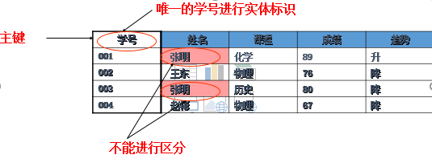
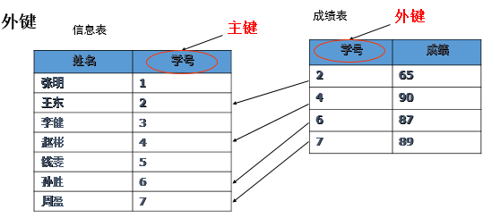
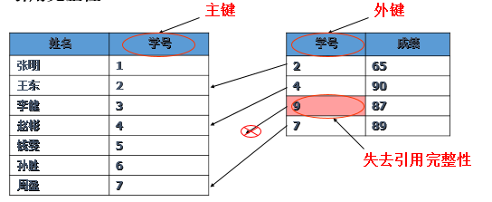
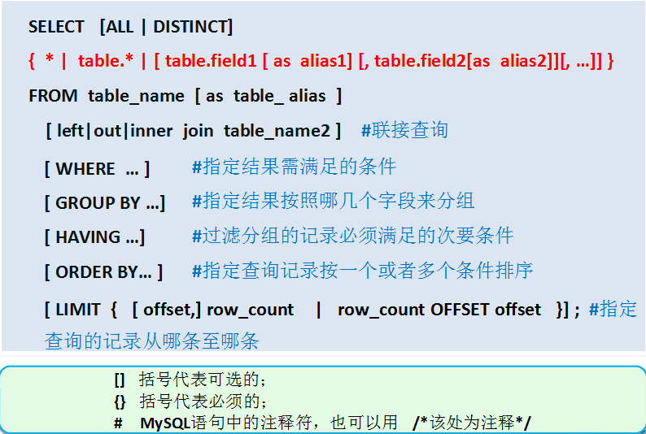
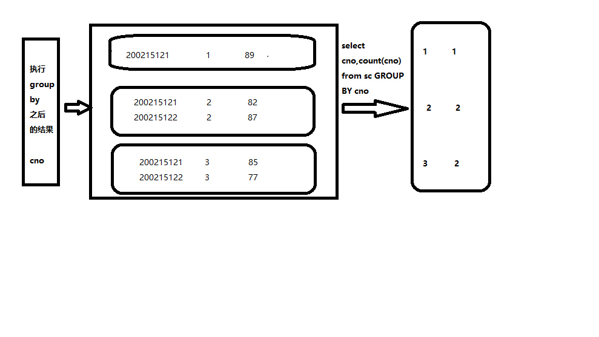
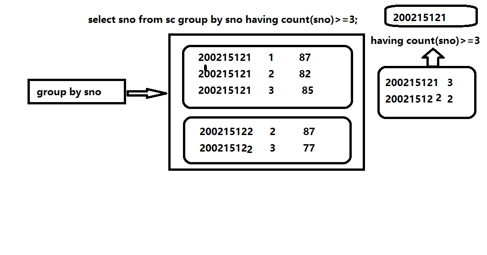

# MYSQL

[TOC]


## 一、数据库编程基础

###1.1实体与属性

•实体

现实世界中任何一个可以识别的对象

数据库中的一条记录对应java中的一个对象，数据库中的一张表对应java中的一个类

•属性

实体所具有的特性，一个实体可用若干属性来描述

•关系数据库中的表现

实体的实例是储存在表中的行，属性是储存在表中的列。

### 1.2实体的关系

•键（key）

在实体属性中，**用于区别实体集合中不同个体**的某个属性或某几个属性的组合，称为关键字（键）。

•主键 （Primary key 非空唯一） 

一个实体的实例上可以有多个不同的键存在，所有这些符合条件的键称为候选键，被指定某个作为主键。

•外键（Foreign key）

非本实体实例的键，但它是其他实体实例的键。又称为外关键字或外部码。

### 1.3关系的三类完整性约束 

•实体完整性

​    每一表要求有一个主键(primary key)，不能取空值，也不能取相同的值 

​    

•引用完整性

   外键（foreign key）的取值要么空值，要么去参考的那个列的取值 

   

   

•域完整性和域约束

   限制某个列的取值

​    check 约束

 


## 二、学生课程实例

### 2.1要创建的表    

- 学生表：Student(Sno,Sname,Ssex,Sage,Sdept)

  ```
  CREATE TABLE Student          
  	      (  Sno   VARCHAR(9) PRIMARY KEY,             
              Sname  VARCHAR(20) NOT NULL,    
              Ssex    VARCHAR(2),
              Sage   INT,
              Sdept  VARCHAR(20)
           );
  ```

  

-  课程表：Course(Cno,Cname,Cpno,Ccredit)// cpno先修课 外键

  ```
   CREATE TABLE  Course
            ( 
                   Cno   INT PRIMARY KEY AUTO_INCREMENT,
                   Cname  VARCHAR(40) NOT NULL,            
                   Cpno     INT ,               	                      
                   Ccredit  INT,
                   FOREIGN KEY (Cpno) REFERENCES  Course(Cno) 
              ); 
  ```

  

- 学生选课表：SC(Sno,Cno,Grade)//sno cno 外键，也是联合主键

  ```
  CREATE TABLE  SC
         	(Sno  VARCHAR(9),
         	Cno  INT,
         	Grade    INT,
          PRIMARY KEY (Sno,Cno), 
         	FOREIGN KEY (Sno) REFERENCES Student(Sno),
         	FOREIGN KEY (Cno) REFERENCES Course(Cno)
  		); 
  ```

### 2.2插入数据

学生表

| 学    号   Sno | 姓    名   Sname | 性    别    Ssex | 年    龄    Sage | 所 在 系    Sdept |
| :------------: | :--------------: | :--------------: | :--------------: | :---------------: |
|   200215121    |       孙策       |        男        |        20        |        CS         |
|   200215122    |       妲己       |        女        |        19        |        CS         |
|   200215123    |      王昭君      |        女        |        18        |        MA         |
|   200515125    |      诸葛亮      |        男        |        19        |        IS         |
|   200215128    |       陈冬       |        男        |        18        |        IS         |

```
INSERT   INTO  Student (Sno,Sname,Ssex,Sdept,Sage)
VALUES ('200215121','孙策','M','CS',20);
# 一次插入多条数据
insert into student(sno,sname,ssex,sage,sdept)
values('200215122','妲己','F',19,'CS'),
('200215123','王昭君','F',18,'MA'), 
('200215125','诸葛亮','M',19,'IS'),
('200215128','张飞','M',18,'IS')
```


课程表

| 课程号   Cno | 课程名   Cname | 先行课   Cpno | 学分   Ccredit |
| ------------ | -------------- | ------------- | -------------- |
| 1            | 数据库         | 5             | 4              |
| 2            | 数学           |               | 2              |
| 3            | 信息系统       | 1             | 4              |
| 4            | 操作系统       | 6             | 3              |
| 5            | 数据结构       | 7             | 4              |
| 6            | 数据处理       |               | 2              |
| 7            | JAVA语言       | 6             | 4              |

```
insert into  course(cname,ccredit)
values( '数据库',4 ),
( '数学',2 ),
( '信息系统',4 ),
( '操作系统',3 ),
( '数据结构',4 ),
( '数据处理',2 ),
( 'JAVA语言',4 )
```

constraint  约束


成绩表

| 学   号   Sno | 课程号     Cno | 成绩       Grade |
| ------------- | -------------- | ---------------- |
| 200215121     | 1              | 92               |
| 200215121     | 2              | 85               |
| 200215121     | 3              | 88               |
| 200215122     | 2              | 90               |
| 200215122     | 3              | 80               |

```
insert into sc
values('200215121',1,92),
('200215121',2,85),
('200215121',3,88),
('2002151student22',2,90),
('200215122',3,80)
```

**步骤**

数据库sql文件导出

在对应的数据库上右击-》转储SQL文件-》结构与数据   导出到指定的位置

数据库sql文件导入

新建数据库-》右击-》运行SQL文件-》选择对应的sql文件-》开始  执行完成后F5刷新数据库，即可看到导入的表信息


### 2.3修改与删除

1. 将学生200215121的年龄改为22岁 

   ```
   update student set sage=22 where sno='200215121'
   ```

2. 所有成绩都减少3分

   ```
   update sc set grade=grade-3
   ```

3. 删除学号为200215128的学生记录

   ```
   delete from student where sno='200215128'
   ```

   主外键建立后注意事项：

   - 当主表没有对应的记录时，不能将记录添加到子表（包含外键的表）
     - 成绩表中不能出现学员信息表中不存在的学号
   - 不能更改主表中的值导致子表中的记录孤立
     - 把学员信息表中的学号改变了，学员成绩表中的学号也应当随之改变  （级联更新）
   - 子表存在与主表对应的记录，不能从主表中删除该行
     - 不能把有成绩的学员删除了
   - 删除主标签，先删子表
     - 先删学员成绩表，后删除学员信息表 （级联删除）

###2.4查询

####2.4.1运算符

**算术运算符**

\+ - * /  %(取余)

```
# mysql中字符串的连接
select CONCAT('a','b','c','n')
select CONCAT('1','1')
```

% 

5%3余数为2 ，取余就是结果就是2

 

**赋值运算符**

=（如在修改表记录时，set之后）

**比较运算符**

=(条件中)  >  <   <>（不等于）  >=   <=   !=（不等于） !>(不大于)   !<

**逻辑运算符**

And与 java中使用&&  满足and两边的条件

Or 或  Java中使用||   满足or一边的条件就行

Not 非 java中使用 ！  非什么

 

**其他运算符**

**数据范围**

Between and   Between 80 and 90->[80,90]

Not between and  

确定集合

In 

Not in  (80,85,90)只在这3个数中选择

**字符匹配（模糊查找）**

Like

Not like  _单个字符（汉字） %0个或多个字符或汉字

**空值（NULL）**

Is Null   这里的null与空串的区别，请知晓

Is not null


####2.4.2查询语法（规定了书写的顺序）

SELECT [ALL|DISTINCT] <目标列表达式>

[，<目标列表达式>] …

FROM <表名或视图名>[， <表名或视图名> ] …

[ WHERE <条件表达式> ]

[ GROUP BY <列名1> [ HAVING <条件表达式> ] ]

[ ORDER BY <列名2> [ ASC|DESC ] ]；




####2.4.3查询练习

1. 

   ```
   # 查询所有学生, *代表所有列，列的顺序即为表中的顺序
   select * from student;
   ```

2. ```
   # 查询学号与姓名、年龄信息(指定列)
   select sno,sname,sage from student;
   ```

3. ```
   # 全体学生的姓名及其出生年份
   select sno,sname,sage,2018-sage from student;
   ```

4. ```
   # 为选定的列指定别名Alias,显示记录时将显示出来
   # 别名，用来显示的名字，小名
   select sno '学号',sname '姓名',sage '年龄',2018-sage '出生年份' from student;
   # as 可加可不加
   select sno as '学号',sname '姓名',sage '年龄',2018-sage '出生年份' from student;
   ```

5. ```
   # 查询全体学生的姓名、出生年份和所在系，   --要求用小写字母表示所有系名
   select sname,2018-sage '出生年份',sdept from student;
   # select LOWER('aBCd')  全部小写   select UPPER("AbcdE"); 全部大写
   # LOWER讲所有的字母变成小写，应用该列的所有行
   select sname,2018-sage '出生年份',LOWER(sdept) from student;
   ```

6. ```
   # 查询选修了课程的学号?有成绩就代表他选修了课程
   # 哪些学生选修了课程，列出他们
   # 去哪张表中查找数据
   select * from sc;
   select DISTINCT sno from sc;  #   distinct 去除重复内容
   ```

7. ```
   -- 查询计算机科学系(CS)全体学生的名单
   SELECT * from student where Sdept='CS' 
   ```

8. ```
   -- 查询所有年龄在20岁以下的学生姓名及其年龄
   SELECT * from student WHERE SAGE<20
   ```

9. ```
   -- 查询年龄在20~23岁之间的学生的姓名、系别和年龄
   SELECT * FROM student WHERE SAGE BETWEEN 20 AND 23  # [20,23] 
   -- 20-23之间的整数 20 21 22 23
   select * from student where sage in(20,21,22,23)
   ```

10. ```
    -- 查询信息系（IS）、数学系（MA）和计算机科学系（CS）学生的姓名和性别
    -- 条件都放在where的后面
    -- in后面跟有穷，有限的集合
    select sname,ssex from student where sdept in('IS','MA','CS');
  ```
  ```

11. ```
    -- like查找称为模糊查找
    -- 查询姓诸葛的学生信息    %有特殊含义，表示0到多个任意字符
    select * from student where sname like '诸葛%'
    -- 查询姓诸葛的学生信息，并且名字只有三个字的  _的特殊含义是1个任意字符
    select * from student where sname like '诸葛_'
  ```

12. ```
    -- 某些没有先修课的课程名  
    -- 条件判断是否为null，只能使用is null 或者is not null
    select cname from course where cpno is null
    ```

13. ```
    -- 查询计算机系年龄在20岁以下的学生姓名 
    -- java && =》MYSQL中使用AND
    select sname from student WHERE Sdept='CS' AND SAGE<20
    ```

14. ```
    # 查询全体学生情况，查询结果按所在系的系名称升序排列
    -- ORDER BY sdept asc   字典顺序  默认是升序排列
    select * from student ORDER BY sdept
    -- 降序排列
    select * from student ORDER BY sdept desc
    ```

15. ```
    -- 查询全体学生情况，查询结果按所在系的系名称升序排列,同一系中的学生按年龄降序排列 
    select * from student ORDER BY sdept ASC, SAGE DESC
    ```

16. ```
    -- 查询一共有多少个学生 COUNT，统计查询出来的行数
    SELECT COUNT(*) FROM STUDENT;
    SELECT count(SNO) FROM STUDENT;
    -- 了解
    SELECT count(1) FROM STUDENT;
    ```

17. 

    ```
    -- 查询有先修课的课程一共有多少门
    select count(*) from course;
    select count(cno) from course;
    -- count 统计不包括null值
    select count(cpno) from course;
    ```

18. ```
    -- 查询一共有多少人选修了课程
    # select DISTINCT sno from sc 去重
    # 先查询  再统计
    select count(DISTINCT sno) as '选课人数' from sc;
    ```

19. ```
    -- 聚集函数sum 求和   avg 求平均数 max 最大值   min最小值 
          
    -- 计算2号课程的学生平均成绩  
    
    select avg(grade) from sc where cno=2
    ```

20. ```
    -- 显示2号课程的最高分   
    select max(grade) from sc where cno=2
    -- 显示2号课程的最低分
    select min(grade) from sc where cno=2
    ```

21. ```
    -- 求2号课程所有成绩的总分   
    select sum(grade) from sc where cno=2
    ```

22. ```
    -- 求各个课程号及其相应的选课人数 
    -- 先分组，在统计，统计的是组内的情况
    -- GROUP BY之后的列才能出现在select语句的选择中，但是对于count统计没有这个限制
    -- COUNT统计内部的列推荐为分组的列
    select cno,count(cno) from sc GROUP BY cno
    ```
    ​       

23. ```
    -- 按系查询男生和女生分别有多少人 
    select sdept, ssex, count(sno)
    from student
    GROUP BY sdept,ssex
    ```

24. ```
    -- 查询选修了3门及以上课程的学生学号 (成绩表中有成绩，即表示选修了该课程)
    -- having是对分组后进一步进行筛选
    -- group by之后进行进一步筛选必须使用having
    select sno from sc group by sno having count(sno)>=3;
    ```

25. 

    ````
    -- 每个学生选修了多少门课程
    select sno, count(sno) from sc group by sno;
    ````

    

26. ```
    # 执行顺序是，先进行where筛选，再分组，再进行having筛选
    select sno from sc  where sno='200215122' group by sno having count(sno)>=3;
    ```

    

    HAVING短语与WHERE子句的区别：

    1.WHERE从中选择满足条件的元组

    2.HAVING短语作用于组，从中选择满足条件的组

27. limit

    ```
    -- 分页
    -- 每页显示三条记录
    -- 第一页 n=1
    SELECT * FROM student
    LIMIT 0,3;
    
    -- 第二页 n=2
    SELECT * FROM student
    LIMIT 3,3;
    
    -- 第三页 n=3
    SELECT * FROM student
    LIMIT 6,3;
    
    -- 第四页 n=4
    SELECT * FROM student
    LIMIT 9,3;
    
    起始位置 = (n-1) * 每页显示的数量;
    
    SELECT count(1) FROM student;
    
    如果 总记录数 % 每页显示的数量 == 0
    那么 总页数 = 总记录数 / 每页显示的数量
    如果 总记录数 % 每页显示的数量 != 0
    那么 总页数 = 总记录数 / 每页显示的数量 + 1
    
    向上取整(12.1) = 13
    向上取整(12.0) = 12
    总页数 = ceil(总记录数 / 每页显示的数量);
    
    SELECT CEIL(count(1)/3) FROM student;
    ```

    

