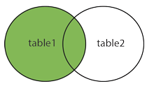

# MYSQL

## 多表查询

1. 查询选课学生及其选修课程的情况（等值连接）

   

   ```
   # 查询出等值连接的所有列
   select *
   from student,sc
   where student.sno=sc.sno
   
   # 查询出等值连接的指定列
   select sname,ssex,sdept,cno,grade 
   from student,sc
   where student.sno=sc.sno
   
   # 遇到重名的列时，一定要指定所属的表
   # 否则会报如下错误  
   # Column 'sno' in field list is ambiguous，记住这个错误
   select sc.sno,sname,ssex,sdept,cno,grade 
   from student,sc
   where student.sno=sc.sno
   
   # 表的别名全权代表表,之后出现表的引用都要使用别名
   select sc.sno,s.sname,ssex,sdept,cno,grade 
   from student AS s,sc
   where s.sno=sc.sno
   ```

2. 查询每一门课的间接先修课（即先修课的先修课） 

   ```
   # 查询每一门课的间接先修课（即先修课的先修课）
   
   SELECT * 
   from course c1, course c2
   where c1.cpno=c2.cno
   
   SELECT c1.cno,c2.cpno
   from course c1, course c2
   where c1.cpno=c2.cno
   
   # 查出间接先修课一定存在的
   SELECT c1.cno,c2.cpno
   from course c1, course c2
   where c1.cpno=c2.cno and c2.cpno is not null
   ```

3. 内连接inner join，等价于等值连接

   

   查询选课学生及其选修课程的情况

   ```
   select *
   from student
   inner JOIN sc
   on student.sno=sc.sno
   
   # 别名
   select s.sno '学号',sname '姓名'
   from student s
   inner JOIN sc  ss
   on s.sno=ss.sno 
   ```

   

4. 外连接

   保留舍弃的元组，在对应被连接表的分量部分用空值(NULL)代替,这种连接被叫做外连接 

   

   **左外连接**

   

   查找每个学生的基本情况及选课情况 

   ```
   select *
   from student   # table1 主表
   LEFT JOIN sc   # table2 从表 
   on student.sno=sc.sno
   # 显示的结果是主表与从表进行等值连接的结果 + 主表与从表没有连接的记录
   ```

   右外连接同理

   

5. 复合条件连接  

   查询选修2号课程且成绩在90分以上的所有学生

   ```
        SELECT Student.Sno, Sname FROM    Student, SC
   	      WHERE Student.Sno = SC.Sno
             AND   SC.Cno= 2 AND SC.Grade > 90；
   ```

6. 查询选课学生的学号、姓名、选修的课程名及成绩 

   ```
    SELECT Student.Sno，Sname，Cname，Grade
      FROM    Student，SC，Course    
      WHERE Student.Sno = SC.Sno 
                      and SC.Cno = Course.Cno；
   ```

7. 嵌套查询

   选修了课程号为2的学生的名字 

   ```
     select sname from student
     where sno in(select sno from sc  where cno=2)
   ```

8. 在SELECT … FROM … WHERE 语句结构的WHERE,FROM,SELECT子句中都可嵌入一个SELECT语句块

   其上层查询称为外层查询或父查询

   其下层查询称为内层查询或子查询

   SQL语言允许使用多重嵌套查询

   嵌套查询的实现一般是从里到外，即先进行子查询，再把其结果用于父查询作为条件

   

   查询与“诸葛亮”在同一个系学习的学生。

   ```
   ① 确定“诸葛亮”所在系名             
   select sdept 
                from student
                where sname='诸葛亮'
   ```

   ```
   ② 查找所有在IS系学习的学生 
   SELECT * 
   from student
   where sdept= 'IS'； 
   ```

   ```
   将第一步查询嵌入到第二步查询的条件中
   SELECT * 
   from student
   where sdept=(select sdept 
                from student
                where sname='诸葛亮') 
         AND SNAME != '诸葛亮'
   ```

9. 查询选修了课程名为“信息系统”的学生学号和姓名

   ```
       SELECT Sno，Sname                       ③ 最后在Student关系中
     	FROM    Student                                     取出Sno和Sname
    	WHERE Sno  IN
                (SELECT Sno                              ② 然后在SC关系中找出选
                 FROM    SC                                    修了3号课程的学生学号
                 WHERE  Cno IN
                        (SELECT Cno                       ① 首先在Course关系中找出
                          FROM Course                      “信息系统”的课程号，为3号
                          WHERE Cname= ‘信息系统’
                        )
                 );
   ```

10. 找出每个学生超过他选修课程平均成绩的课程号。

  ```
   select sno,cno
   from sc x
   where grade>(
        select avg(grade) 
        from sc y
        where x.sno=y.sno
   )
  ```
  

  

  

11. 查询其他系中比计算机科学某一学生年龄小的学生姓名和年龄

      ````
      SELECT * FROM STUDENT WHERE  
      SAGE< ANY(select sage from student 
      where sdept='CS') AND SDEPT !='CS'
      # 另一种写法
      SELECT * FROM STUDENT WHERE  
      SAGE< (select MAX(sage) from student 
      where sdept='CS') AND SDEPT !='CS'
      ````

      <all 小于最小 小于所有（10,20,5）  >all 大于最大

      <any 小于最大     小与任何一个      >any 大于最小

## MYSQL常用函数

数学函数

ABS(VAL)绝对值

MOD(V1,V2) 取余

FLOOR(X)  取下整

CEIL(X)  取上整

ROUND(X)  四舍五入

```
select ABS(-20);
select MOD(9,4);
select FLOOR(1.2);
SELECT CEIL(1.2);
SELECT ROUND(1.4);
```

字符串函数

CONCAT(str1,str2,...):返回来自于参数连结的字符串 

LENGTH(str):返回字符串str的长度 

LEFT(str,len):返回字符串str的最左面len个字符。 

RIGHT(str,len):返回字符串str的最右面len个字符。  

SUBSTRING(str,pos):从字符串str的起始位置pos返回一个子串 

SUBSTRING(str,pos,len):从字符串str的起始位置pos返回一个len长度的子串 

REVERSE(str):返回颠倒字符顺序的字符串str。 

```
SELECT CONCAT('HELLO','WORLD');
SELECT LENGTH("HELLO");
SELECT LEFT('HELLO',3); # 3代表长度，从左边开始取3个
SELECT RIGHT('HELLO',3);
SELECT SUBSTRING("HELLO WORLD",3);    # 起始位置从1开始
SELECT SUBSTRING("HELLO WORLD",3, 5);  # LLO W   5代表长度，
SELECT REVERSE("HELLO");  # OLLEH
```


日期函数

```
select CURTIME(); 
select CURDATE(); 
select NOW(); 
```

YEAR(date) 

HOUR(time) 

MINUTE(time) 

SECOND(time):

DAYNAME(date):返回date的星期名字 

DAYOFWEEK(date):返回日期date的星期索引(1=星期天，2=星期一, …7=星期六)。

```
select NOW(); 
select CURTIME(); 
select CURDATE();
select SYSDATE(); 

select YEAR('2012-09-09')
select MONTH('2012-10-09')
SELECT MINUTE(NOW())

select MINUTE('2012-10-09 12:12:12')

select dayname('2012-11-17 12:12:12')

select DAYOFWEEK('2011-11-11 11:11:11')
```

