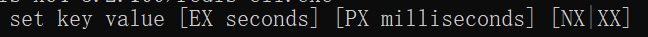
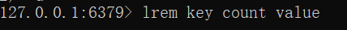

# Redis基础

## 数据库

Redis数据库保存在服务器状态redisServer结构的db数组中，这个db数组中的每个元素都是一个redisDb结构，而每个redisDb结构就代表一个Redis数据库。

Redis服务器状态有一个dbnum属性，该属性用于在启动Redis服务器时，决定创建多少个数据库。Redis服务器配置中的database选项决定了dbnum属性的值。默认dbnum属性的值是**16**，也就是在启动redis服务器时，会默认创建16个（0-15号）数据库。

通常我们在操作Redis数据库时，默认操作的是Redis的0号数据库。如果想操作其他数据库，则可以使用SELECT命令来切换数据库。如切换到4号数据库

```
SELECT 4
```

redis服务器内部，有一个db属性，这个属性是客户端状态redisClient中的属性，他是一个指向redisDb结构的指针，用于记录当前客户端操作的目标数据库。通过修改制定index的值，也就是修改redisClient.db指针，来指向服务器中的不同数据库，达到切换数据库的目的。

redisDb结构中存储了数据库中所有的键值对，每个键就是一个字符串对象，而每个键对应的值可以是字符串对象，集合对象，有序集合对象，列表对象或哈希表对象。

键值对的数据库：

键： String

值：String  Hash  List  Set  SortedSet

以下增删取改均是针对String值得操作，如果值是其他类型，写法会不同

基于内存的数据库


## 增删取改

### 添加键

```
127.0.0.1:6379> set name 'tzhang'
OK
127.0.0.1:6379> set age 10
OK
```

### 取键值

```
127.0.0.1:6379> get name         # 可以获取
"hello-redis" 
```

### 修改键

```
127.0.0.1:6379> set name 'hello-redis'
OK
```

**设置键过期时间**

```
127.0.0.1:6379> expire name 60   # 单位秒
(integer) 1
127.0.0.1:6379> get name         # 可以获取
"hello-redis" 
127.0.0.1:6379> get name         # 60秒后获取
(nil)
```

键的生存时间变为0，此时服务器会自动删除生存时间为0的键

pexpire 命令修改键的生命周期，以毫秒为单位

expireat在某个时刻过期，单位秒

pexpireat在某个时刻过期，单位毫秒

```
127.0.0.1:6379> time
1) "1564675983"   秒
2) "348791"
```

获取剩余有效时间

```
127.0.0.1:6379> set name tzhang
OK
127.0.0.1:6379> ttl name
(integer) -1
127.0.0.1:6379> expire name 20
(integer) 1
127.0.0.1:6379> ttl name
(integer) 12
```

PTTL命令返回一个键的剩余生存时间，以毫秒为单位

persist删除一个键的生存时间

```
127.0.0.1:6379> expire name 100
(integer) 1
127.0.0.1:6379> ttl name
(integer) 97
127.0.0.1:6379> persist name
(integer) 1
127.0.0.1:6379> ttl name
(integer) -1    # 返回-1表示已删除生存时间
```

### 删除键

```
127.0.0.1:6379> get name
"qq"
127.0.0.1:6379> del name
(integer) 1
127.0.0.1:6379> get name
(nil)
```

## 数据类型

Redis数据库支持5种数据类型，分别是String（字符串），Hash（哈希），List(列表)，Set（集合）及Sorted Set（有序集合）。

Redis命名名称的大小写并不会影响命令表的查找结果。在获取键值对中的值时，如果值是中文的，则会返回编码后的字符串，如果希望返回值时中文的，那么客户端连接服务器时，可以使用命令“**redis-cli-raw**”将底层编码的字符串转换成中文。

### String

最基本的数据类型，是二进制安全的，任何形式的字符串都可以存储，包括二进制数据，序列化后的数据，JSON化的对象，设置一张经Base64编码后的图片。String类型的键最大能存储512M的数据。

SET命令将字符串value设置到key中，如果key已存在，则会覆盖旧值并且忽略类型，针对带生存时间的key来说，SET成功后，这个KEY上的生存时间会被清除。

#### SET



EX seconds：设置key的过期时间为多少秒，SET key value EX seconds等价于SETEX key seconds value

PX milliseconds：设置过期时间为多少毫秒，其中 SET key value PX milliseconds等价于PSETEX key milliseconds value

NX：表示当key不存在时，才对key进行设置操作，其中set key value NX，等价于SETNX key value

XX：表示当key存在时，才对key进行设置操作。

返回值：如果SET命令设置成功，则会返回ok

```
127.0.0.1:6379> set stuName tzhang  EX 100  # 带有效时间
OK
127.0.0.1:6379> ttl stuName  # 查看有效时间
(integer) 92
127.0.0.1:6379> set stuName tt xx  # 如果存在则设置
OK
127.0.0.1:6379> ttl stuName   # 有效时间已失效
(integer) -1
127.0.0.1:6379> set stuName aa nx   # 已存在设置失败
(nil)
127.0.0.1:6379> SET stuId 10 NX  # 不存在设置成功
OK
127.0.0.1:6379> get stuId   # 获取
"10"
```

#### MSET

同时设置多个键值对，已存在则覆盖，使用一次性添加如下信息

| stuId    | stuName | age  | sex  | height |
| -------- | ------- | ---- | ---- | ------ |
| 08070201 | mayun   | 20   | man  | 170    |

```
127.0.0.1:6379> mset stuId 08070201 stuName mayun age 20 set man height 170
OK
127.0.0.1:6379> get age
"20"
```

#### SETNX

设置不存在的键值对，成功返回1，失败返回0

```
127.0.0.1:6379> setnx collegeName nau-pc
(integer) 1
127.0.0.1:6379> setnx collegeName nau-xx
(integer) 0
```

#### MSETNX

同时设置多个不存在的键值对，当且仅当所有给定key都不存在时设置，所有字段要么全部失败，要么全部成功。

设置成功返回1，设置失败返回0

#### GET

获取key中设置的字符串值，如果key中存储的值不是字符串类型，则会返回一个错误，GET命令只能用于处理字符串的值，当key不存在时，返回nil

```
127.0.0.1:6379> get age
"20"
```

#### MGET

返回多个给定的key的值，key之间使用空格隔开，如果key中有不存在的key，那么这个key返回值为nil

```
127.0.0.1:6379> mget stuId stuName
1) "08070201"
2) "mayun"
```

#### GETRANGE

获取键的子字符串


start开始end结束的字符串，下标从0开始，可以取负值，表示从字符串最后开始计数，-1表示最后一个字符，-2表示倒数第二个字符。

返回值：返回截取的子字符串

```
127.0.0.1:6379> getrange stuName 1 2
"ay"
```

#### SETEX

为键设置生存时间

```
SETEX key seconds value
```

等价于

```
set key value
expire key seconds
```

#### PSETEX

为键设置生存时间，毫秒

```
PSETEX key milliseconds value
```

#### SETRANGE

替换键的值

```
SETRANGE key offset value
```

offset:指定的开始位置

```
127.0.0.1:6379> get stuName
"mayun"
127.0.0.1:6379> setrange stuName 2 huateng
(integer) 9
127.0.0.1:6379> get stuName
"mahuateng"
```

原字符和偏移量之间的空白将用零字节（Zerobytes，'\x00'）来填充

```
127.0.0.1:6379> setrange stuName 20 abc
(integer) 23
127.0.0.1:6379> get stuName
"mahuateng\x00\x00\x00\x00\x00\x00\x00\x00\x00\x00\x00abc"
```

#### GETSET

返回旧值，设置新值，当key存在但不是字符串类型时，返回错误，key不存在，返回nil。

```
127.0.0.1:6379> getset stuName mayun
"mahuateng\x00\x00\x00\x00\x00\x00\x00\x00\x00\x00\x00abc"
127.0.0.1:6379> get stuName
"mayun"
```

#### APPEND

```
APPEND key value
```

为键追加值，如果key存在且是字符串类型时，则将value值追加到旧值的末尾,如果key不存在，则将key设置为value

```
127.0.0.1:6379> get stuName
"mayun"
127.0.0.1:6379> append stuName ali
(integer) 8
127.0.0.1:6379> get stuName
"mayunali"
```

### STRLEN

统计键的字符长度

```
127.0.0.1:6379> strlen stuName
(integer) 8
```

#### DECR

存储的数字值减1

```
127.0.0.1:6379> get age
"20"
127.0.0.1:6379> decr age
(integer) 19
```

如果key不存在，则key先被初始化为0，在减1操作

#### DECRBY

```
DECRBY key decrment
```

键的值减去减量值

```
127.0.0.1:6379> get height
"170"
127.0.0.1:6379> decrby height 5
(integer) 165
```

#### INCR

键的值加1

```
INCR key
```

#### INCRBY

```
INCRBY key increment
```

#### INCRBYFLOAT

键的值加上浮点数的增量值

```
INCRBYFLOAT key increment
```

### 哈希（Hash）命令

是一个String类型的域（field）和值（value）得映射表，用来存储对象信息。Reids中，每个哈希表可以存储2^32-1个键值对，也就是40多亿个数据。

#### HSET

为hash表的域设置值

```
127.0.0.1:6379> HSET stu id 001
(integer) 1
127.0.0.1:6379> hset stu name tzhang\
(integer) 1
127.0.0.1:6379> hset stu age 20
```

已存在则覆盖，返回0

#### HSETNX

为哈希表不存在的域设值

```
HSETNX key field value
```

#### HMSET

设值多个域和值到哈希表中

```
HMSET key field value [field value..]
```

已存在，则覆盖，不存在，则新建哈希表执行设置操作

#### HGET

```
HGET key field
```

key或者field不存在，则将返回nil

```
127.0.0.1:6379> hget stu age
"20"
```

HGETALL

获取所有哈希表中的域和值

```
127.0.0.1:6379> hgetall stu
1) "id"
2) "001"
3) "name"
4) "tzhang\\"
5) "age"
6) "20"
```

key不存在，返回空列表

#### HMGET

获取多个域的值

```
HMGET key filed [field....]
```

```
127.0.0.1:6379> hmget stu age id
1) "20"
2) "001"
```

#### HKEYS

获取哈希表中的所有域

```
HKEYS key
```

```
127.0.0.1:6379> hkeys stu
1) "id"
2) "name"
3) "age"
```

#### HVALS

返回key中所有域的值

```
HVALS key
```

```
127.0.0.1:6379> hvals stu
1) "001"
2) "tzhang\\"
3) "20"
```

#### HELN

统计域的数量

```
HLEN key
```

```
127.0.0.1:6379> hlen stu
(integer) 3
```

#### HSTRLEN

统计域的值得字符串长度

```
HSTRLEN key field
```

#### HINCRBY

域加上增量值

```
HINCRBY key field increment
```

#### HINCRBYFLOAT

域加上浮点数增量值

```
HINCRBYFLOAT key field increment
```

#### HDEL

删除哈希表中的多个域

```
HDEL key field [field...]
```

#### HEXISTS

判断哈希表中的域是否存在

```
HEXISTS key field
```

### List

可以看做简单的字符串列表，列表按照插入顺序排序，可以将一个元素插入这个列表的头部或者尾部。一个列表大约可以存储2^32-1个元素

#### LPUSH

将一个或多个值插入到列表头部，返回列表长度

```
LPUSH key value [value....]
```

```
127.0.0.1:6379> lpush letter a b c d
(integer) 4
```

#### LRANGE

获取列表指定范围内的元素, 区间以偏移量 START 和 END 指定。 其中 0 表示列表的第一个元素， 1 表示列表的第二个元素，也可以使用负数下标，以 -1 表示列表的最后一个元素， -2 表示列表的倒数第二个元素。

```
127.0.0.1:6379> lrange letter 0 3
1) "d"
2) "c"
3) "b"
4) "a"
```

#### LPUSHX

将一个值插入到已存在的列表头部，列表不存在时操作无效。返回列表长度

```
127.0.0.1:6379> LPUSHX letter e   
(integer) 5
127.0.0.1:6379> lrange letter 0 1
1) "e"
2) "d"
```

#### RPUSH

将一个或多个值插入到列表的尾部

```
 RPUSH KEY VALUE1..VALUEN
```

#### RPUSHX

将一个值插入到已存在的列表尾部(最右边)。如果列表不存在，操作无效。

如果列表不存在，一个空列表会被创建并执行 RPUSH 操作。 当列表存在但不是列表类型时，返回一个错误。

```
RPUSHX KEY VALUE1..VALUEN
```


#### LINDEX

通过索引获取列表中的元素

```
LINDEX KEY INDEX
```

```
127.0.0.1:6379> lindex letter 1
"w"
```


#### LLEN

获取列表长度

```
127.0.0.1:6379> llen letter
(integer) 4
```

### LREM

根据参数 COUNT 的值，移除列表中与参数 VALUE 相等的元素。

- count > 0 : 从表头开始向表尾搜索，移除与 VALUE 相等的元素，数量为 COUNT 。
- count < 0 : 从表尾开始向表头搜索，移除与 VALUE 相等的元素，数量为 COUNT 的绝对值。
- count = 0 : 移除表中所有与 VALUE 相等的值。



```
127.0.0.1:6379> lpush letter a b
(integer) 7
127.0.0.1:6379> lrem letter 1 b
(integer) 1    # 移除数据的个数 
127.0.0.1:6379> lrange letter 0 7   # 前面的b已没了
1) "a"
2) "e"
3) "d"
4) "c"
5) "b"
6) "a"
127.0.0.1:6379> lrem letter -5 a
(integer) 2  
127.0.0.1:6379> lrange letter 0 4
1) "e"
2) "d"
3) "c"
4) "b"
```

#### LSET

通过索引来设置元素的值。当索引参数超出范围，或对一个空列表进行 LSET 时，返回一个错误。

```
LSET KEY INDEX VALUE
```

```
127.0.0.1:6379> lset letter 1 w
OK
127.0.0.1:6379> lrange letter 1 1
1) "w"
```

#### LPOP

移除并返回列表的第一个元素

```
127.0.0.1:6379> LLEN letter
(integer) 4
127.0.0.1:6379> lpop letter
"e"
127.0.0.1:6379> llen letter
(integer) 3
```

#### RPOP

移除列表的最后一个元素，返回值为移除的元素。

```
127.0.0.1:6379> lrange letter 0 3
1) "w"
2) "c"
3) "b"
127.0.0.1:6379> rpop letter
"b"
127.0.0.1:6379> lrange letter 0 3
1) "w"
2) "c"
```

#### LTRIM

让列表只保留指定区间内的元素，不在指定区间之内的元素都将被删除。

下标 0 表示列表的第一个元素， 1 表示列表的第二个元素，也可以使用负数下标，-1 表示列表的最后一个元素， -2 表示列表的倒数第二个元素，依次类推。

```
127.0.0.1:6379> lrange letter 0 4
1) "w"
2) "c"
3) "x"
4) "y"
5) "z"
127.0.0.1:6379> ltrim letter 0 -1
OK
127.0.0.1:6379> lrange letter 0 4
1) "w"
2) "c"
3) "x"
4) "y"
5) "z"
127.0.0.1:6379> ltrim letter 0 3
OK
127.0.0.1:6379> lrange letter 0 4
1) "w"
2) "c"
3) "x"
4) "y"
```

#### RPOPLPUSH

移除列表的最后一个元素，并将该元素添加到另一个列表并返回。

```
rpoplpush source destination
```

```
127.0.0.1:6379> lrange letter 0 4
1) "w"
2) "c"
3) "x"
4) "y"
127.0.0.1:6379> rpoplpush letter destlist
"y"
127.0.0.1:6379> lrange destlist 0 2
1) "y"
```

#### LINSERT 

列表的元素前或者后插入元素。当指定元素不存在于列表中时，不执行任何操作。

当列表不存在时，被视为空列表，不执行任何操作。

如果 key的值不是列表类型，返回一个错误。

```
linsert key BEFORE|AFTER pivot value
```

将值 value 插入到列表 key 当中，位于值 pivot 之前或之后。

```
127.0.0.1:6379> lrange letter 0 4
1) "w"
2) "c"
3) "x"
127.0.0.1:6379> linsert letter before c a
(integer) 4
127.0.0.1:6379> lrange letter 0 4
1) "w"
2) "a"
3) "c"
4) "x"
```

#### BLPOP

移出并获取列表的第一个元素， 如果列表没有元素会阻塞列表直到等待超时或发现可弹出元素为止。单位：秒

```
blpop key [key....] timeout
```

如果列表为空，返回一个 nil 。 否则，返回一个含有两个元素的列表，第一个元素是被弹出元素所属的 key ，第二个元素是被弹出元素的值

```
127.0.0.1:6379> blpop destlist 60000
1) "destlist"
2) "y"
127.0.0.1:6379> blpop destlist 60000
1) "destlist"
2) "v"
```

cmd重新打开一个redis-cli.exe向该列表中添加值，在值没有获取之前，会一直阻塞。

#### BRPOP

移出并获取列表的最后一个元素， 如果列表没有元素会阻塞列表直到等待超时或发现可弹出元素为止。

### 集合SET

String类型的无序集合，且不存在重复的元素，所以进行增加，删除，查询操作时效率非常高。

#### SADD

向集合添加一个或多个成员

```
SADD key member[member...]
```

```
127.0.0.1:6379> sadd setdemo a b c a d e
(integer) 5
```

#### SCARD

获取集合的成员数

```
127.0.0.1:6379> scard setdemo
(integer) 5
```

#### SMEMBERS

```
127.0.0.1:6379> smembers setdemo
1) "b"
2) "d"
3) "c"
4) "a"
5) "e"
```

#### SISMEMBER

判断成员元素是否是集合的成员。如果成员元素是集合的成员，返回 1 。 如果成员元素不是集合的成员，或 key 不存在，返回 0 。

````
127.0.0.1:6379> sismember setdemo a
(integer) 1
````

#### SDIFF

返回给定集合之间的差集。不存在的集合 key 将视为空集。

```
127.0.0.1:6379> sadd setdemo1 a b ca d
(integer) 4
127.0.0.1:6379> sdiff setdemo setdemo1
1) "e"
2) "c"
```

#### SDIFFSTORE

将给定集合之间的差集存储在指定的集合中。如果指定的集合 key 已存在，则会被覆盖。

```
127.0.0.1:6379> sdiffstore setdemo2 setdemo setdemo1
(integer) 2
127.0.0.1:6379> smembers setdemo2
1) "e"
2) "c"
```

#### SINTER

返回给定所有集合的交集

```
127.0.0.1:6379> sinter setdemo setdemo1
1) "b"
2) "d"
3) "a"
```

#### SINTERSTORE

返回给定所有集合的交集并存储在 destination 中


#### SPOP 

移除集合中的指定 key 的一个或多个随机元素，移除后会返回移除的元素。

```
spop key [count]                 # count移除的个数
```

```
127.0.0.1:6379> spop setdemo2
"e"
```

#### SRANDMEMBER

返回集合中一个或多个元素

- 如果 count 为正数，且小于集合基数，那么命令返回一个包含 count 个元素的数组，数组中的元素各不相同。如果 count 大于等于集合基数，那么返回整个集合。
- 如果 count 为负数，那么命令返回一个数组，数组中的元素可能会重复出现多次，而数组的长度为 count 的绝对值。

```
srandmember KEY [count]
```

```
127.0.0.1:6379> srandmember setdemo 3
1) "e"
2) "a"
3) "c"
```

#### SREM

移除集合中一个或多个成员

```
127.0.0.1:6379> srem setdemo a b
(integer) 2
```

#### SUNION

返回所有给定集合的并集

```
127.0.0.1:6379> smembers setdemo
1) "d"
2) "e"
3) "c"
127.0.0.1:6379> smembers setdemo1
1) "b"
2) "d"
3) "ca"
4) "a"
127.0.0.1:6379> sunion setdemo setdemo1
1) "d"
2) "ca"
3) "e"
4) "b"
5) "a"
6) "c"
```

#### SUNIONSTORE 

将给定集合的并集存储在指定的集合 destination 中。如果 destination 已经存在，则将其覆盖。

#### SMOVE

```
smove source destination member
```

将 member 元素从 source 集合移动到 destination 集合

```
127.0.0.1:6379> smembers setdemo2
1) "c"
127.0.0.1:6379> smove setdemo setdemo2 e
(integer) 1
127.0.0.1:6379> smembers setdemo2
1) "e"
2) "c"
```


### 有序集合Sorted Set

有序集合不存在重复的元素，每个元素都有一个double类型的分数，通过这个元素对应的分数为集合元素从小到大的排序的。

#### ZADD

```
ZADD key score member [[score,memner] [score,memner]....]
```

## 持久化

Redis所有数据存储在内存中，当退出或重启之后，所有存储的数据就会丢失。我们希望Redis重启后可以保证数据不丢失。

- 利用Redis作为数据库存储数据，长久保存数据
- Redis作为缓存服务器，缓存大量数据，但当缓存被穿透后，会对其性能造成较大影响，更甚会导致缓存同时失效，雪崩，从而使得服务器停止服务

**缓存击穿**

缓存击穿表示恶意用户模拟请求很多缓存中不存在的数据，由于缓存中都没有，导致这些请求短时间内直接落在了数据库上，导致数据库异常。

**缓存雪崩**

缓存在同一时间内大量键过期（失效），接着来的一大波请求瞬间都落在了数据库中导致连接异常。

解决redis服务器重启之后数据丢失的问题，希望redis采用某种方式将数据从内存保存到硬盘中，重启后从硬盘恢复，这个过程就是持久化，产生的文件称为持久化文件。

目前redis支持两种持久化方式，1.AOF持久化 2.RDB持久化

### AOF持久化

append only file，保存服务器执行的所有写操作命令到单独的日志文件中，服务器重启时，通过加载日志文件中的这些命令并执行恢复数据。

默认情况下，AOF命令没有被开启，通过修改配置文件redis.conf中的appendonly参数开启

```
appendonly yes
```

默认文件名称是appendonly.aof

AOF文件重写，以达到压缩的目的。随着服务器的运行，AOF文件的内容数据越来越大，所占据的内存也会变大，过大的AOF影响服务器的正常运行，在执行数据恢复时，将会消耗更多的时间。定期重写AOF文件，以减小文件的体积，删除冗余命令

- AOF文件重写会丢弃过期的数据
- AOF文件重写会丢弃无效的命令，包括重复设置某个键值对的命令，删除某些数据时的命令等。
- AOF文件重写将多条命令合并为一条命令

### RDB

生成RDB文件，一个经过压缩的二进制文件，也可以理解为快照文件，通过该文件还原生成RDB文件时的数据库状态。RDB保存在硬盘上。在**指定的时间间隔内**，自动将内存中的所有数据生成一份副本并存储在硬盘上

根据redis配置文件redis.conf中的配置自动触发快照

```
save 900 1   （秒）
save 300 10
save 60 1000
```

save m n:时间m和被修改的键的个数n，当在时间m内被修改的键的个数大于n时，就会触发BGSAVE命令，服务器自动执行快照操作。

默认情况下，Redis将数据库快照保存在名为dump.rdb的文件中。


**AOF持久化方式的实时性更好，也就是当进程意外退出时，丢失的数据更少**,更多情况下，可以将二者结合起来使用。